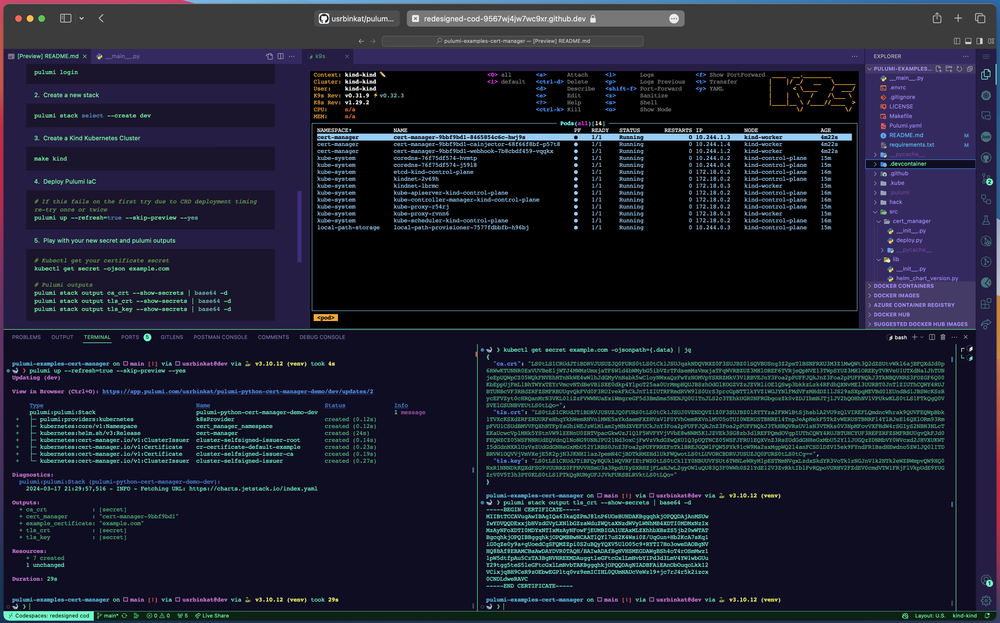

# Pulumi Cert Manager Exercise

[]() [](https://www.pulumi.com/docs/get-started/install/) [](https://kubernetes.io/docs/tasks/tools/install-kubectl/) [](https://kind.sigs.k8s.io/docs/user/quick-start/) [](https://docs.docker.com/get-docker/)

## About

This repo contains a testing environment and exercise for exploring [cert-manager] `ClusterIssuer` certificate resource creation and using Pulumi's [intputs/outputs & Apply](https://www.pulumi.com/docs/concepts/inputs-outputs/apply) methods to extract secret data values as variables for use in subsequent resources and as Pulumi stack outputs for consumption by other stacks.

> [](https://codespaces.new/usrbinkat/pulumi-examples-cert-manager)
>
> 
>
> Powered by the [Pulumi Devcontainer](https://code.visualstudio.com/docs/devcontainers/containers)

[cert-manager]: https://cert-manager.io

## Getting Started

Launch this exercise in GitHub Codespaces with the 'Open in GitHub Codespaces' button above, or git clone locally and open with VSCode + Remote Containers VSCode Extension + Docker Desktop.

Codespaces is the easiest way to get started quickly. Simply click the button above to open this repository in a new Codespace and then continue from [Setup](#first-time-setup) instructions below.

## Setup

1. Pulumi Login

```bash
# Login to Pulumi Cloud & install python dependencies
pulumi login && pulumi install
```

2. Create a Kind Kubernetes Cluster

```bash
make kind
```

3. Create a new stack

```bash
pulumi stack select --create dev
```

4. Deploy Pulumi IaC

```bash
# If this fails on the first try due to CRD deployment timing re-try once or twice
pulumi up --skip-preview
```

5. Play with your new secret and pulumi outputs

```bash
# Kubectl get your certificate secret
kubectl get secret -ojson example.com

# Pulumi outputs
pulumi stack output ca_crt --show-secrets | base64 -d
pulumi stack output tls_crt --show-secrets | base64 -d
pulumi stack output tls_key --show-secrets | base64 -d
```

## Cleanup

```bash
make clean-all
```
